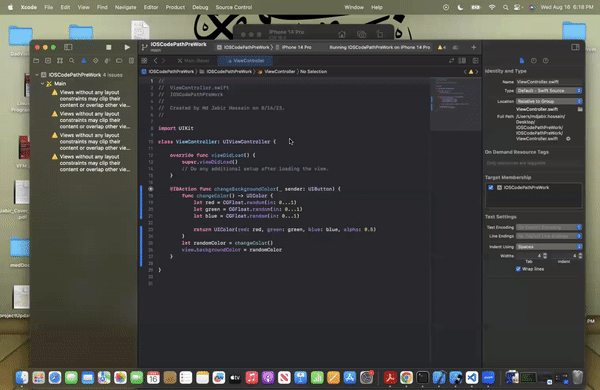

# Prework - _Background Refresher_

Submitted by: **Md Jabir Hossain**

**Background Refresher** is an app that contains three labels and a button. The labels display
the author's name, university, and anticipated future job.

Time spent: **1.5** hours spent in total

## Required Features

The following **required** functionality is completed:

- [ ] Users are see a screen with three labels and a button
- [ ] Tapping the button changes the screen color to a random color

## Video Walkthrough

Here's a walkthrough of implemented user stories:

<!-- Replace this with whatever GIF tool you used! -->

GIF created with https://ezgif.com/

<!-- Recommended tools:
[Kap](https://getkap.co/) for macOS
[ScreenToGif](https://www.screentogif.com/) for Windows
[peek](https://github.com/phw/peek) for Linux. -->

## App Brainstorming (Step 4)

Twitter - I like the concept of the app, that allows users to write short tweets. This can be concise and informative. - I like the UI of twitter, with its color themes, and how the sections or the tweets are divided into boxes, with grey lines seperating them. - I like the shapes, sizes, and colors of the icons that are used in the app, specially on the left pane. - Overall, the app is simple but creates a feeling of ampleness without overwhelmingness despite a large amount of text.

Duolingo - Amazing UX, with its different icons, widgets, and colors. - Very appealing in how the lessons are divided into sections, and small animated characters that accompany the texts with appropriate facial expressions. - The interactions with the app is very satisfying because of the shape and effect of the UI elements when touched. - An effective app to learn a new language.

Youtube - Overall the layout of the app makes it very immersive. - Uses very few colors to create an appealing theme. - Hovering over any video plays the video without opening it or shows the preview, and the red progress bar is excellent.

Spotify - Cool UI with many shades of black and dark colors, which result in subtle contrast among UI elements. - Appealing display gradient that adds to the vibe of a song or album. - Layout and overall organization of the tracks are really nice.

## Notes

Describe any challenges encountered while building the app.

## License

    Copyright [yyyy] [name of copyright owner]

    Licensed under the Apache License, Version 2.0 (the "License");
    you may not use this file except in compliance with the License.
    You may obtain a copy of the License at

        http://www.apache.org/licenses/LICENSE-2.0

    Unless required by applicable law or agreed to in writing, software
    distributed under the License is distributed on an "AS IS" BASIS,
    WITHOUT WARRANTIES OR CONDITIONS OF ANY KIND, either express or implied.
    See the License for the specific language governing permissions and
    limitations under the License.
